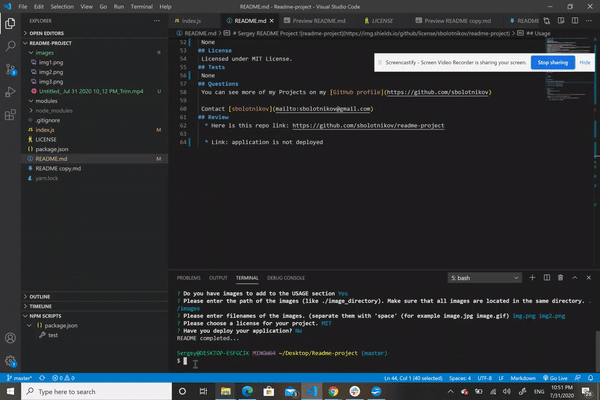

# Sergey README project 
## Description 
The standard chunk of Lorem Ipsum used since the 1500s is reproduced below for those interested. Sections 1.10.32 and 1.10.33 from "de Finibus Bonorum et Malorum" by Cicero are also reproduced in their exact original form, accompanied by English versions from the 1914 translation by H. Rackham.
## Table of Contents
* [Installation](#installation)
* [Usage](#usage)
* [Contributing](#contributing)
* [Tests](#tests)
* [License](#license)
* [Questions](#questions)
* [Review](#review)
## Installation 
lo,ikmujtyhbgvrfcedxcfvghbukmil,kmjngvbfcdxcfvgrtyhbjukilmujnyhbtgvfcdxcfvghbjnmknjhbtgv

## Usage 
mjnhgvbfcdcfvgbhnjm ngbvfcxfgvhnjmknhgbvfcgtyhuj

 

## Contributing 
jnjyhbtgvrfghjnkm,lmkjnyhbtgvfcgvbhnmkujnyhbg
## License 
 Licensed under MIT License. 
## Tests 
kmjnhbgvfcvgthbjnukilkmujnyhtgrhyju
## Questions 
 You can see more of my Projects on my [GitHub profile](https://github.com/sbolotnikov) 

 Contact [sbolotnikov](mailto:sbolotnikov@gmail.com) 
## Review 
  * Here is this repo link: https://github.com/sbolotnikov/readme-project
 
  * Link: [Sergey README project](https://sbolotnikov.github.io/readme-project)