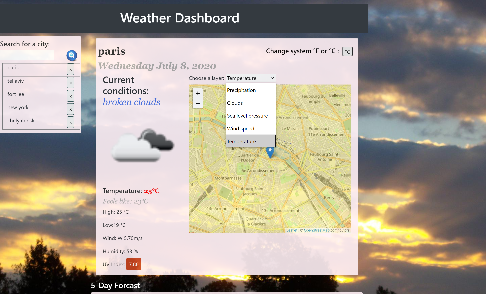
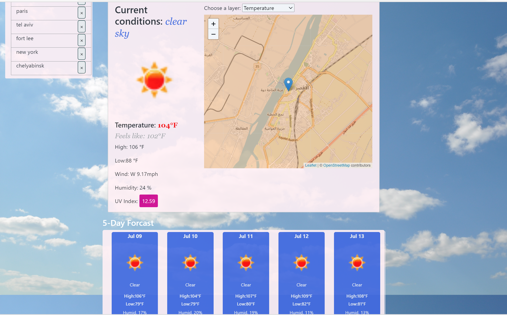
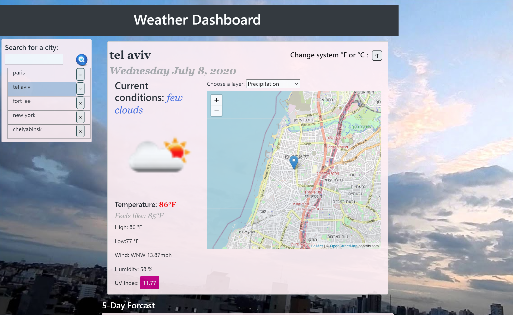

# Sergey README Project 
## Description 
The standard chunk of Lorem Ipsum used since the 1500s is reproduced below for those interested. Sections 1.10.32 and 1.10.33 from "de Finibus Bonorum et Malorum" by Cicero are also reproduced in their exact original form, accompanied by English versions from the 1914 translation by H. Rackham.
## Table of Contents
* [Installation](#installation)
* [Usage](#usage)
* [License](#license)
* [Questions](#questions)
## Installation 
Git clone the app then Do your thing
## Usage 
Use at your risque

## Contributing 
undefined
## License 
 Licensed under MIT License. 
## Tests 
undefined
## Questions 
 Contact [sbolotnikov](mailto:sbolotnikov@gmail.com)